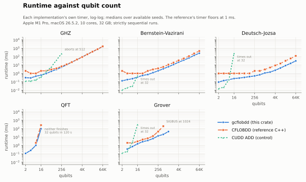
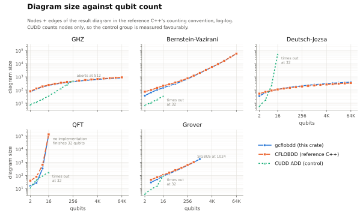
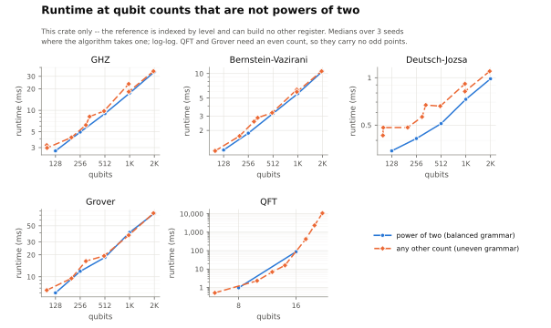
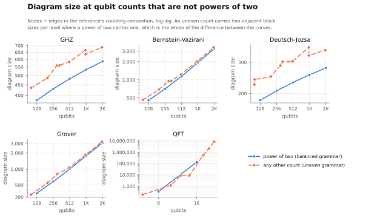

# Benchmarks

Quantum algorithms and matrix operations in this crate, measured beside the
reference C++ CFLOBDD ([`trishullab/cflobdd`](https://github.com/trishullab/cflobdd),
unweighted build) and CUDD's ADDs as a BDD-family control.

**Machine.** Apple M1 Pro, 10 cores, 32 GB, macOS 26.5.2 (Darwin 25.5.0). Runs
are strictly sequential; nothing else was on the machine.

**Builds.** rustc 1.95.0, `cargo build --release --test quantum --features bigint`.
Apple clang 21.0.0 with Boost 1.89.0. CUDD 3.0.0 (`--enable-obj`).

Raw runs, scripts and figures are in [`results/macos-m1pro/`](results/macos-m1pro).

```bash
# the ladder, 2 to 65536 qubits, both implementations
LABEL=rust-bigint ONLY=rust RUST_BIN=<bigint build> PMAX=16 SEEDS=1 \
  OUT=results/ladder.csv scripts/compare_cflobdd.sh ghz bv dj
ONLY=cpp PMAX=16 SEEDS=1 APPEND=1 OUT=results/ladder.csv scripts/compare_cflobdd.sh ghz bv dj
PMAX=4 scripts/compare_cflobdd.sh qft            # QFT separately; both sides stop at 16

# Grover, ten seeds per size
LABEL=rust-bigint ONLY=rust RUST_BIN=<bigint build> PMIN=2 PMAX=10 \
  SEEDS="1 2 3 4 5 6 7 8 9 10" OUT=results/grover_compare.csv \
  scripts/compare_cflobdd.sh grover

# qubit counts that are not powers of two, this crate only
BIN=<bigint build> OUT=results/uneven.csv results/macos-m1pro/uneven.sh

# the control group
CUDD=<cudd_test build> OUT=results/cudd.csv results/macos-m1pro/cudd.sh

cargo test --test matmul --release -- --dense-level 4   # matrix operations
```

## Reading the size column

The two implementations do not count the same thing. The reference counts **two
edges per connection plus the entries of every distinct return map**; this crate
counts one edge per connection and no return maps at all. A ratio between those
two numbers is a ratio between two counters, not between two diagrams.

Every `size` in this document is therefore **nodes + edges under the reference's
convention**, on both sides -- `count_cflobdd_convention` here, `CountNodesAndEdges`
there. Node counts alone are convention-free and agree.

| algorithm | qubits | reference, its counter | gcflobdd, ref counter | reference, gcflobdd counter | gcflobdd, its counter |
|---|--:|--:|--:|--:|--:|
| GHZ | 2,048 | 634 | 586 | 356 | 332 |
| GHZ | 65,536 | 914 | 846 | 516 | 482 |
| Bernstein-Vazirani | 2,048 | 3,329 | 3,270 | 1,895 | 1,863 |
| Bernstein-Vazirani | 16,384 | 16,510 | 16,432 | 9,427 | 9,385 |
| Deutsch-Jozsa | 2,048 | 241 | 279 | 137 | 155 |
| Deutsch-Jozsa | 16,384 | 298 | 351 | 170 | 197 |
| QFT | 8 | 644 | 336 | 46 | 29 |
| QFT | 16 | 132,238 | 131,917 | 308 | 287 |
| Grover | 32 | 161 | 140 | 89 | 78 |
| Grover | 512 | 1,028 | 998 | 585 | 570 |

The gap between the two conventions is not a constant factor. It is almost the
whole number in the extreme case. Take 16-qubit QFT: the diagram is 5 nodes and
282 connections, which is this crate's 287. Under the reference's convention the
same diagram is 131,917 -- 5 nodes, 564 edges, and **131,348 return-map entries,
99.6% of the total**. The reference's own 132,238 for the same circuit is within
0.3% of it.

## Results

At the top of each ladder:

| | gcflobdd | reference | speed | gcflobdd size | reference size |
|---|--:|--:|--:|--:|--:|
| **GHZ**, 65,536 qubits | **1,577 ms** | 1,652 ms | **1.0x** | 846 | 914 |
| **Bernstein-Vazirani**, 65,536 qubits | **255 ms** | 463 ms | **1.8x** | 58,620 | 58,799 |
| **Deutsch-Jozsa**, 65,536 qubits | **31 ms** | 121 ms | **3.9x** | 399 | 338 |
| **QFT**, 16 qubits | **95 ms** | 263 ms | **2.8x** | 131,917 | 132,238 |
| **Grover**, 512 qubits | **20 ms** | 193 ms | **9.4x** | 998 | 1,038 |

**Both implementations produce diagrams of the same size.** Within 8% on four of
the five algorithms, and on Deutsch-Jozsa this crate's is 18% *larger*. The
representations agree; what differs is the time to build them.

**Runtime.** This crate is faster on Bernstein-Vazirani, Deutsch-Jozsa, QFT and
Grover at *every* size measured: 1.6x to 15x on BV, 2.4x to 11x on DJ, 2.0x to
2.8x on QFT, 1.8x to 9.4x on Grover. The widest ratios are at small sizes, where
the reference's 1 ms timer granularity flatters the comparison; the figures above
are the honest ones. GHZ is a tie at 1.05x. Every run in the table finishes
inside 3.7 s wall clock.

**Reach.** Both run GHZ, Bernstein-Vazirani and Deutsch-Jozsa correctly at every
size from 2 to 65,536 qubits. On Grover the reference dies with SIGBUS at 1,024
qubits, where this crate is still verified against theory; under a weaker check
it answers correctly to 65,536 (see *Grover*). No implementation finishes
32-qubit QFT.





Every run, three implementations:

| algorithm | qubits | gcflobdd | reference | CUDD | gcflobdd size | reference size | CUDD nodes |
|---|--:|--:|--:|--:|--:|--:|--:|
| GHZ | 2 | 0.308 ms | 2 ms | 0.21 ms | 73 | 81 | 8 |
|  | 4 | 0.288 ms | 1 ms | 0.124 ms | 118 | 130 | 12 |
|  | 8 | 0.463 ms | 1 ms | 0.186 ms | 170 | 186 | 20 |
|  | 16 | 0.619 ms | 2 ms | 0.409 ms | 222 | 242 | 36 |
|  | 32 | 0.967 ms | 2 ms | 1.28 ms | 274 | 298 | 68 |
|  | 64 | 1.78 ms | 3 ms | 5.86 ms | 326 | 354 | 132 |
|  | 128 | 2.97 ms | 4 ms | 34 ms | 378 | 410 | 260 |
|  | 256 | 5.47 ms | 7 ms | 234 ms | 430 | 466 | 516 |
|  | 512 | 11 ms | 12 ms | aborts | 482 | 522 | -- |
|  | 1,024 | 22 ms | 22 ms | -- | 534 | 578 | -- |
|  | 2,048 | 44 ms | 45 ms | -- | 586 | 634 | -- |
|  | 4,096 | 91 ms | 89 ms | -- | 638 | 690 | -- |
|  | 8,192 | 192 ms | 188 ms | -- | 690 | 746 | -- |
|  | 16,384 | 376 ms | 391 ms | -- | 742 | 802 | -- |
|  | 32,768 | 783 ms | 777 ms | -- | 794 | 858 | -- |
|  | 65,536 | 1,577 ms | 1,652 ms | -- | 846 | 914 | -- |
| GHZ (state vector) | 2 | 0.074 ms | -- | -- | 14 | -- | -- |
|  | 4 | 0.107 ms | -- | -- | 46 | -- | -- |
|  | 8 | 0.196 ms | -- | -- | 70 | -- | -- |
|  | 16 | 0.319 ms | -- | -- | 94 | -- | -- |
|  | 32 | 0.486 ms | -- | -- | 118 | -- | -- |
|  | 64 | 0.9 ms | -- | -- | 142 | -- | -- |
|  | 128 | 1.71 ms | -- | -- | 166 | -- | -- |
|  | 256 | 3.39 ms | -- | -- | 190 | -- | -- |
|  | 512 | 6.33 ms | -- | -- | 214 | -- | -- |
|  | 1,024 | 13 ms | -- | -- | 238 | -- | -- |
|  | 2,048 | 25 ms | -- | -- | 262 | -- | -- |
|  | 4,096 | 55 ms | -- | -- | 286 | -- | -- |
|  | 8,192 | 118 ms | -- | -- | 310 | -- | -- |
|  | 16,384 | 235 ms | -- | -- | 334 | -- | -- |
|  | 32,768 | 545 ms | -- | -- | 358 | -- | -- |
|  | 65,536 | 1,018 ms | -- | -- | 382 | -- | -- |
| Bernstein-Vazirani | 2 | 0.13 ms | 2 ms | 0.0168 ms | 37 | 74 | 7 |
|  | 4 | 0.18 ms | 1 ms | 0.0233 ms | 65 | 100 | 11 |
|  | 8 | 0.231 ms | 1 ms | 0.0518 ms | 103 | 146 | 19 |
|  | 16 | 0.37 ms | 1 ms | 0.448 ms | 148 | 209 | 35 |
|  | 32 | 0.569 ms | 1 ms | timeout | 214 | 272 | -- |
|  | 64 | 0.736 ms | 2 ms | -- | 294 | 370 | -- |
|  | 128 | 1.21 ms | 3 ms | -- | 458 | 524 | -- |
|  | 256 | 2.02 ms | 4 ms | -- | 692 | 776 | -- |
|  | 512 | 3.53 ms | 6 ms | -- | 1,150 | 1,231 | -- |
|  | 1,024 | 6.24 ms | 11 ms | -- | 1,923 | 2,001 | -- |
|  | 2,048 | 11 ms | 19 ms | -- | 3,270 | 3,401 | -- |
|  | 4,096 | 22 ms | 36 ms | -- | 5,485 | 5,627 | -- |
|  | 8,192 | 38 ms | 60 ms | -- | 9,268 | 9,379 | -- |
|  | 16,384 | 70 ms | 113 ms | -- | 16,432 | 16,540 | -- |
|  | 32,768 | 140 ms | 235 ms | -- | 30,624 | 30,715 | -- |
|  | 65,536 | 255 ms | 463 ms | -- | 58,620 | 58,799 | -- |
| Deutsch-Jozsa | 2 | 0.093 ms | 1 ms | 0.0139 ms | 35 | 53 | 6 |
|  | 4 | 0.14 ms | 1 ms | 0.0325 ms | 63 | 72 | 18 |
|  | 8 | 0.179 ms | 1 ms | 0.185 ms | 87 | 91 | 233 |
|  | 16 | 0.244 ms | 1 ms | 219 ms | 111 | 110 | 53,517 |
|  | 32 | 0.279 ms | 1 ms | timeout | 135 | 129 | -- |
|  | 64 | 0.334 ms | 1 ms | -- | 159 | 148 | -- |
|  | 128 | 0.409 ms | 1 ms | -- | 183 | 167 | -- |
|  | 256 | 0.502 ms | 2 ms | -- | 207 | 186 | -- |
|  | 512 | 0.683 ms | 2 ms | -- | 231 | 205 | -- |
|  | 1,024 | 1.13 ms | 3 ms | -- | 255 | 224 | -- |
|  | 2,048 | 1.43 ms | 5 ms | -- | 279 | 243 | -- |
|  | 4,096 | 2.37 ms | 9 ms | -- | 303 | 262 | -- |
|  | 8,192 | 4.35 ms | 15 ms | -- | 327 | 281 | -- |
|  | 16,384 | 8.49 ms | 32 ms | -- | 351 | 300 | -- |
|  | 32,768 | 16 ms | 60 ms | -- | 375 | 319 | -- |
|  | 65,536 | 31 ms | 121 ms | -- | 399 | 338 | -- |
| QFT | 2 | 0.112 ms | 0 ms | 0.0346 ms | 16 | 40 | 12 |
|  | 4 | 0.255 ms | 0 ms | 0.201 ms | 27 | 80 | 47 |
|  | 8 | 1.02 ms | 2 ms | 9.76 ms | 336 | 644 | 95 |
|  | 16 | 95 ms | 263 ms | 52,850 ms | 131,917 | 132,238 | 175 |
| Grover | 4 | 0.367 ms | 2 ms | 0.208 ms | 29 | 47 | 9 |
|  | 8 | 0.728 ms | 2 ms | 2.7 ms | 50 | 73 | 16 |
|  | 16 | 1.54 ms | 3 ms | 329 ms | 90 | 110 | 95 |
|  | 32 | 2.78 ms | 5 ms | timeout | 140 | 161 | -- |
|  | 64 | 3.84 ms | 7 ms | -- | 218 | 250 | -- |
|  | 128 | 6.51 ms | 13 ms | -- | 359 | 388 | -- |
|  | 256 | 13 ms | 45 ms | -- | 587 | 624 | -- |
|  | 512 | 20 ms | 193 ms | -- | 998 | 1,038 | -- |
|  | 1,024 | 45 ms | -- | -- | 1,765 | -- | -- |

## Qubit counts that are not powers of two

The reference is indexed by *level*: a level-`p` CFLOBDD has `2^p` variables, so
`2^p` qubits is the only register it can build. This crate takes the count
itself. `Register` in `tests/quantum.rs` splits a qubit count into its ceiling
and floor halves down to one qubit's `S -> a a`; a power of two divides evenly at
every level and reproduces the balanced family exactly, and any other count
divides unevenly.

Nothing in the matrix algebra notices. The deferred semiring never asks *where* a
grouping divides its variables -- it recurses on whatever two sub-grammars a rule
names, multiplies their exit maps and lifts the result. The one thing it needs is
that the division fall between two `(row, column)` pairs rather than through one,
which in the interleaved order is exactly **every grammar node covers an even
number of variables**. Building the tree over qubits gives that for free at any
count. Balance, equal splits and power-of-two dimensions are not required and are
never checked; `check_matrix_grammar` in `src/gcflobdd/matmul/mod.rs` enforces
even variables and binary groupings, and nothing more.

Pass `qN` instead of `p` to ask for exactly `N` qubits. Every run below is
correct; times are medians over 3 seeds where the algorithm takes one.

| qubits | grammar | ghz time | ghz size | bv time | bv size | dj time | dj size | grover time | grover size |
|--:|---|--:|--:|--:|--:|--:|--:|--:|--:|
| **100** | 4 uneven | 2.79 ms | 434 | 1.15 ms | 458 | 0.47 ms | 225 | 6.82 ms | 331 |
| **101** | 6 uneven | 3.35 ms | 435 | 1.17 ms | 466 | 0.53 ms | 240 | -- | -- |
| 128 | balanced | 3.04 ms | 378 | 1.22 ms | 458 | 0.40 ms | 183 | 6.40 ms | 352 |
| **200** | 4 uneven | 4.55 ms | 486 | 1.91 ms | 692 | 0.56 ms | 249 | 10.24 ms | 549 |
| 256 | balanced | 5.49 ms | 430 | 2.07 ms | 706 | 0.49 ms | 207 | 13.10 ms | 584 |
| **300** | 6 uneven | 7.01 ms | 560 | 2.98 ms | 955 | 0.68 ms | 288 | 18.18 ms | 803 |
| **333** | 8 uneven | 9.18 ms | 561 | 2.96 ms | 963 | 0.78 ms | 303 | -- | -- |
| **500** | 6 uneven | 11.16 ms | 583 | 3.83 ms | 1,223 | 0.83 ms | 304 | 21.06 ms | 1,057 |
| 512 | balanced | 10.87 ms | 482 | 3.60 ms | 1,136 | 0.70 ms | 231 | 19.52 ms | 998 |
| **999** | 9 uneven | 27.18 ms | 665 | 6.64 ms | 2,033 | 1.19 ms | 365 | -- | -- |
| **1,000** | 6 uneven | 23.22 ms | 635 | 6.46 ms | 2,024 | 1.09 ms | 328 | 38.56 ms | 1,849 |
| 1,024 | balanced | 21.55 ms | 534 | 6.28 ms | 1,923 | 0.90 ms | 255 | 42.98 ms | 1,769 |
| **2,000** | 6 uneven | 41.56 ms | 687 | 12.59 ms | 3,455 | 1.48 ms | 352 | 78.71 ms | 3,264 |
| 2,048 | balanced | 42.74 ms | 586 | 11.11 ms | 3,270 | 1.38 ms | 279 | 76.29 ms | 3,100 |

**An exact count costs about what the neighbouring power of two costs.** Across
all 33 uneven points the time ratio against the next power of two up runs from
0.64x to 1.32x, and the size ratio from 0.80x to 1.43x. The premium has a
structural cause and a bound: an uneven tree carries two adjacent block sizes at
each level where a power of two carries one, so it has at most twice as many
distinct grammar nodes -- 1,000 qubits resolves into 16 distinct block sizes
against 1,024's 11.

Only three of the five algorithms take an *odd* count. `sqrt(N) = 2^(n/2)` runs
through Grover's iteration count, its initial amplitude and its theory check, and
through QFT's `2^(-n/2)` normalisation, and every amplitude type here carries an
integer exponent. That is the algorithms' arithmetic asking, not the
representation: 101, 333 and 999 qubits of GHZ, Bernstein-Vazirani and
Deutsch-Jozsa all run, and the smoke test runs them at 5 and 7.





### Where it matters: QFT

| qubits | grammar | qft time | qft size |
|--:|---|--:|--:|
| **6** | 1 uneven | 0.55 ms | 178 |
| 8 | balanced | 0.98 ms | 336 |
| **10** | 2 uneven | 2.29 ms | 1,186 |
| **12** | 1 uneven | 6.60 ms | 8,437 |
| **14** | 2 uneven | 15.71 ms | 8,542 |
| 16 | balanced | 84.40 ms | 131,917 |
| **18** | 3 uneven | 423.59 ms | 526,023 |
| **20** | 2 uneven | 2,240.39 ms | 2,100,380 |
| **22** | 3 uneven | 10,962.26 ms | 8,395,111 |

QFT is the algorithm whose cost is dominated by the register rather than the
circuit, and it is where rounding a qubit count up to the next power of two stops
being a rounding error. **Ten qubits of QFT cost 2.3 ms and a diagram of 1,186.
Rounding that up to 16 costs 84 ms and 131,917** -- 37x the time and 111x the
diagram, to simulate a register six qubits wider than the one asked for. Above 16
there is no rounding up at all: this crate reaches 22 qubits in 11 s and 2.5 GB,
and 32 qubits finishes in neither implementation.

## Grover

The reference's Grover rows come from a build carrying the upstream fix for an
uninitialised field in its dense multiply. On this machine the unpatched build is
indistinguishable from it -- correct on 10 of 10 seeds at every size it reaches,
with matching times and sizes -- so the fix changes nothing here; it is applied
because the ladder above 256 qubits was measured with it.

Ten seeds per size. Both are correct on all ten at every size to 512 qubits;
above that the reference does not run.

### How far it goes

`testGroversAlgoBig` uses wide-float exponentiation of the Grover operator. The
theory check is f64 arithmetic and refuses past 2,046 qubits, so larger runs ask
for `answer`: the peak still has to land on the planted string, only the
whole-state comparison against theory is dropped.

| qubits | time | peak RSS | nodes | size | answer |
|--:|--:|--:|--:|--:|:-:|
| 1,024 | 0.06 s | 8 MB | 261 | 1,769 | correct |
| 2,048 | 0.07 s | 13 MB | 452 | 3,100 | correct |
| 4,096 | 0.18 s | 24 MB | 768 | 5,306 | correct |
| 8,192 | 0.61 s | 66 MB | 1,307 | 9,073 | correct |
| 16,384 | 2.78 s | 211 MB | 2,329 | 16,221 | correct |
| 32,768 | 12.80 s | 728 MB | 4,355 | 30,397 | correct |
| 65,536 | 75.02 s | 2,755 MB | 8,353 | 58,377 | correct |

### Iteration, exponentiation, and how much mantissa it takes

Three variants: honest iteration (`testGroversAlgo`), f64 exponentiation
(`testGroversAlgoFast`) and wide-float exponentiation (`testGroversAlgoBig`).

| qubits | iterate | fast | big |
|--:|--:|--:|--:|
| 2 | 0.1 ms, correct | 0.1 ms, correct | 0.1 ms, correct |
| 4 | 0.2 ms, correct | 0.4 ms, correct | 0.4 ms, correct |
| 8 | 0.2 ms, correct | 0.8 ms, correct | 0.7 ms, correct |
| 16 | 0.4 ms, correct | 1.5 ms, correct | 1.4 ms, correct |
| 32 | 12.1 ms, correct | 2.5 ms, correct | 2.6 ms, correct |
| 64 | -- | 3.8 ms, correct | 3.7 ms, correct |
| 128 | -- | 6.4 ms, peak only | 6.2 ms, correct |
| 256 | -- | 12.1 ms, peak only | 12.9 ms, correct |
| 512 | -- | 18.0 ms, peak only | 19.7 ms, correct |
| 1,024 | -- | 46.6 ms, **wrong** | 42.7 ms, correct |

Honest iteration is `O(sqrt(N))` applications of the Grover operator and stops
being practical at 64 qubits; exponentiation replaces them with `O(log sqrt(N))`
squarings. The precision is what separates the two exponentiating variants:
squaring the operator `n/2` times needs a mantissa satisfying `2(b+1) > n`, and
f64's 53 bits give out at 128 qubits. Past that its state is still *peaked* on
the right string -- the answer looks right -- while the amplitudes no longer
match theory, and at 1,024 qubits the diagram collapses to a single node and the
answer is wrong. It is the whole-state check against theory, not the peak, that
catches it.

## Matrix operations

No comparable reference driver exists (`testMatrixMultiplication` is marked
obsolete and takes no size), so these are this crate only, from
`cargo test --test matmul --release -- --dense-level 4`:

| operation | dimension | time | diagram |
|---|--:|--:|--:|
| Kronecker fold of a 2x2 | 2^128 square | <1 ms | 17 nodes |
| `I * I`, `(J-I) * I` | 2^32 square | <1 ms | 13 nodes |
| `(J-I) * e_0` (matrix-vector) | 2^32 | <1 ms | 25 nodes |
| dense random `A * A` | 256 x 256 | 6.5 s | 8,354 nodes |
| dense random `A * v` | 256 | 29 ms | 8,363 nodes |

A Kronecker fold costs exactly two nodes per doubling. The dense random case is
the worst case by construction -- an unstructured matrix has nothing to share --
and is three orders of magnitude slower than the structured ones at the same
dimension.

## Arbitrary-precision coefficients

The deferred semiring counts how many products coincide, and a Hadamard layer
over `n` qubits makes that count `2^n`. With `i128` coefficients that overflows
at 128 qubits -- exact arithmetic refusing to be wrong rather than a blow-up in
time or memory. The `bigint` feature swaps in [`rug::Integer`], which is what
`boost::multiprecision::cpp_int` does for the reference. On the GHZ ladder:

| qubits | `i128` | `bigint` | overhead |
|--:|--:|--:|--:|
| 2 | 0.21 ms | 0.16 ms | 0.74x |
| 4 | 0.30 ms | 0.26 ms | 0.87x |
| 8 | 0.37 ms | 0.39 ms | 1.05x |
| 16 | 0.54 ms | 0.63 ms | 1.17x |
| 32 | 0.82 ms | 0.94 ms | 1.13x |
| 64 | 1.43 ms | 1.63 ms | 1.14x |
| 128 | overflow | 2.93 ms | -- |
| 256 | overflow | 5.30 ms | -- |
| 512 | overflow | 10 ms | -- |
| 1,024 | overflow | 20 ms | -- |
| 2,048 | overflow | 44 ms | -- |
| 4,096 | overflow | 86 ms | -- |
| 8,192 | overflow | 188 ms | -- |
| 16,384 | overflow | 366 ms | -- |
| 32,768 | overflow | 723 ms | -- |
| 65,536 | overflow | 1,533 ms | -- |

Under the ceiling the overhead is at most 17%; the sub-millisecond rows sit
inside process-startup noise and should not be read as `bigint` winning. Above
the ceiling it is the difference between a result and a panic. Every other number
in this document is from the `bigint` build.

## The control group: CUDD

CUDD's ADDs are a BDD-family baseline, run from the reference repository's own
`examples/cudd_test` driver with a **120-second cap** per size -- the same order
as the budget the two CFLOBDDs ran under -- and no larger size attempted after
one times out (`results/macos-m1pro/cudd.sh`).

| algorithm | last size it finishes | time there | ADD nodes | next size |
|---|--:|--:|--:|---|
| GHZ | 256 qubits | 234.48 ms | 516 | aborts at 512 |
| Bernstein-Vazirani | 16 qubits | 0.45 ms | 35 | times out at 32 |
| Deutsch-Jozsa | 16 qubits | 219.32 ms | 53,517 | times out at 32 |
| Grover | 16 qubits | 328.69 ms | 95 | times out at 32 |
| QFT | 16 qubits | 52.85 s | 175 | times out at 32 |

Its QFT is the one path in that driver that carries the state as a *pair* of
ADDs, real and imaginary; the node count above is their sum, which is what the
driver's own return value is.

The gap is two to three orders of magnitude in reachable qubit count -- 16 or
256 against 65,536 -- which is the result the CFLOBDD representation exists to
produce. Deutsch-Jozsa is the clearest single row: 53,517 ADD nodes at 16 qubits
against 111 and 110 for the two CFLOBDDs, and no 32-qubit run at all.

**QFT is the one row where the ADD is the compact object, and it is a warning
about the size column rather than a result.** At 16 qubits CUDD's ADD is 175
nodes where the CFLOBDDs report about 132,000 -- but those 132,000 are nodes
plus return-map entries, and the CFLOBDDs' *node* counts are 5 and 11. CUDD has
no return maps to report and does not count its terminals, so the two numbers
measure different things and neither is a memory figure. What is comparable is
the time: **52.9 s for CUDD against 95 ms here**, a factor of 557. All three
then fail at 32 qubits.

## Caveats

**Timers.** Each implementation reports its own internal timer around the same
phase of the algorithm. The reference's has 1 ms granularity, which floors
several of its small-size rows at 0 and inflates the ratios there; the
microsecond figures in `results/macos-m1pro/*.csv` are this crate's only.

**Memory.** Peak RSS at 65,536 qubits is 280-541 MB here against 820-920 MB for
the reference, but most of that difference is a fixed reservation: the reference
starts at ~679 MB before it has done any work, this crate at ~3 MB. Measured as
*growth* over an empty run, the reference is the leaner of the two -- 141 MB
against 298 MB on 65,536-qubit GHZ.

**GHZ is two circuits.** `testGHZAlgoMatrix` builds the reference's own
construction, a 2n-qubit register held as a matrix, and is the row that compares
with it. `testGHZAlgo` is the textbook circuit on an n-variable state vector: a
smaller object with no reference number to compare against, listed separately as
*GHZ (state vector)*.

**Seeds.** One seed per size on GHZ, Bernstein-Vazirani and Deutsch-Jozsa; three
on QFT and the uneven sweep; ten on Grover. Where a table gives one number for
several seeds it is the median.

**QFT above 16 qubits** is this crate only, and the reference's 16-qubit rows
vary by seed -- 66,498 on one of three, 132,238 on the other two -- so the QFT
size comparison rests on a small sample.
