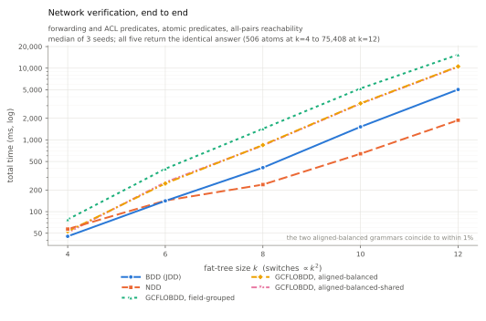
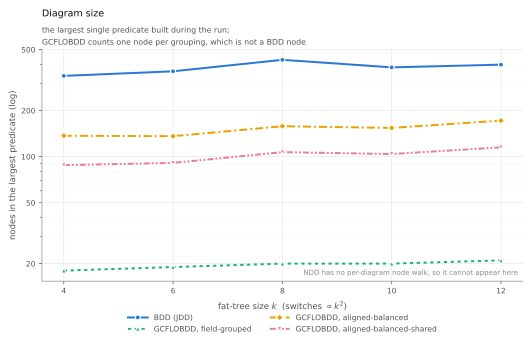
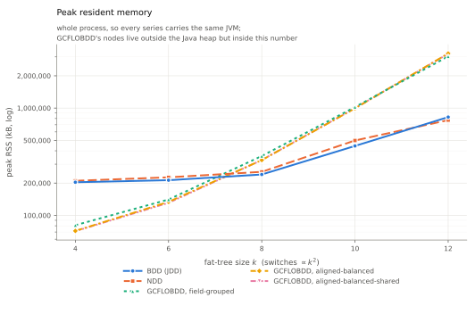

# Network verification

GCFLOBDD measured against NDD ([XJTU-NetVerify/NDD](https://github.com/XJTU-NetVerify/NDD),
NSDI '25) and a plain BDD on the workload NDD was built for: atomic predicates
and all-pairs reachability over a data plane.

**Machine.** Apple M1 Pro, 10 cores, 32 GB, macOS 26.5.2 (Darwin 25.5.0). Runs
are strictly sequential; nothing else was on the machine.

**Builds.** rustc 1.95.0, `cargo build --release` in `gcflobdd-jni` (no `rug`,
no GMP), `smallvec` 1.15.2. OpenJDK 24.0.1, `-Xmx12g`. NDD at `c8414b4`, its core recompiled from
source rather than from its prebuilt jar, which predates NDD's int-handle rewrite.

Per-operation costs quoted below come from [`tests/opbench.rs`](tests/opbench.rs)
(`cargo test --release --test opbench`), which also reports allocations per
operation.

Harness, raw runs, scripts and figures: [`bench/netverify/`](bench/netverify),
[`results/macos-m1pro/netverify.csv`](results/macos-m1pro/netverify.csv),
[`results/macos-m1pro/netverify_all.csv`](results/macos-m1pro/netverify_all.csv).

```bash
NDD_REPO=/path/to/NDD bench/netverify/build.sh
KS="4 6 8 10 12" SEEDS="1 2 3" OUT=results/netverify.csv scripts/compare_netverify.sh
python3 results/macos-m1pro/build_netverify_tables.py
python3 results/macos-m1pro/plot_netverify.py
```

## What NDD ships, and why the workload is ours

Nothing network-shaped in the NDD repo is runnable as it stands.

| benchmark | code | data | runs? |
|---|---|---|---|
| N-Queens | yes | none needed | **yes** — already covered by [`tests/n_queens.rs`](tests/n_queens.rs) |
| WAN data-plane verification (APKeep-style) | yes, but **excluded from NDD's own Maven build** on `main` | Purdue / Stanford / Internet2, **not shipped** | no |
| Batfish, all-pairs under *k* failures | a 132-line patch against an external repo | external | no |
| SRE (`bgp_fattree*`) | **not in the repo**, results only | external | no |
| NDD API JUnit tests | yes | none needed | yes, correctness only |

`/datasets/` is gitignored on all four branches (`main`, `reuse`, `ndd-original`,
`mtndd`), and both WAN drivers hardcode an absolute path on the authors' machine
(`/data/zcli-data/network-decision-diagram/datasets/wan/purdue/pd`). The WAN
verifier is additionally excluded by `pom.xml` because it still uses the
object-based NDD API from before the int-handle rewrite and no longer type-checks;
the last branch where it compiles is `origin/reuse`.

So the data plane here is generated: a k-ary fat-tree with longest-prefix-match
FIBs and ClassBench-shaped ACLs, from a fixed seed. It is reproducible and it
scales on demand, but it is not real router configuration — read the numbers for
what they are.

| k | switches | FIB rules | ACL rules | distinct predicates | atomic predicates | reachable pairs |
|--:|--:|--:|--:|--:|--:|--:|
| 4 | 20 | 180 | 72 | 60 | 506 | 196 |
| 6 | 45 | 420 | 162 | 168 | 3,358 | 1,821 |
| 8 | 80 | 840 | 288 | 341 | 7,821 | 9,579 |
| 10 | 125 | 1,500 | 450 | 574 | 26,095 | 36,215 |
| 12 | 180 | 2,460 | 648 | 892 | 75,408 | 100,422 |

## Field layout and grammars

NDD's five-tuple, unchanged: src_ip(32), dst_ip(32), src_port(16), dst_port(16),
protocol(8) — 104 bits, in that order, bit 0 of each field being its MSB. Three
GCFLOBDD grammars over that same 104-leaf order:

| id | grammar |
|---|---|
| `field-grouped` | `S -> BDD(32) BDD(32) BDD(16) BDD(16) BDD(8)` — NDD's own decomposition, expressed as a GCFLOBDD grammar |
| `aligned-balanced` | `S -> A B; A -> SI32 DI32; B -> SP16 C; C -> DP16 PR8`, each field its own perfect binary tree down to single bits |
| `aligned-balanced-shared` | the same tree, but one `W32`/`W16`/`W8`/`W4`/`W2` shared by every field of that width |

Every coarse split falls on a field boundary, so a field is always an intact
subtree. The two aligned-balanced variants differ only in symbol identity — and
since GCFLOBDD node identity is keyed on the grammar node's address, that alone
decides whether a src_ip subtree may share nodes with a dst_port one.

## Correctness first

All five engines return the identical answer at every size and seed: the same
atomic-predicate count, the same reachable-pair count, and sat-count digests
agreeing to 1e-9. `build_netverify_tables.py` re-checks this on every run and
prints `cross-implementation agreement: OK`.

Agreement alone would only say they agree, so `netbench.SelfTest` checks the
encoding against brute force: every port-range prefix cover is exact, prefix and
range sat counts match theory, and a hand-checked three-rule ACL yields exactly
the four atoms you get by reading it.

That check earned its keep. JDD collects garbage inside `mk`, so an unreferenced
intermediate can have its slot recycled by the very next operation. The first full
run had JDD reporting **82,050 atomic predicates where every other engine reported
81,993** — a bug in this harness, not in JDD. Every builder now returns a handle
carrying one reference the caller owns.

## Runtime

Median of three seeds, whole run: forwarding predicates, ACL predicates, atomic
predicates, all-pairs reachability.

| k | BDD (JDD) | NDD | GCFLOBDD field-grouped | aligned-balanced | aligned-balanced-shared |
|--:|--:|--:|--:|--:|--:|
| 4 | 43 ms | 50 | 72 | 42 | **41 ms** |
| 6 | 130 ms | **105 ms** | 322 | 192 | 180 |
| 8 | 381 ms | **214 ms** | 1,203 | 646 | 715 |
| 10 | 1,464 ms | **606 ms** | 4,390 | 2,550 | 2,802 |
| 12 | 5,121 ms | **1,713 ms** | 13,108 | 8,853 | 9,218 |



**NDD's claim reproduces.** It starts level with the BDD and pulls away as the
problem grows — 1.8x at k=8, 2.4x at k=10, **3.0x at k=12** — which is the shape
its paper reports, on an independent harness.

**GCFLOBDD is slower here, by a steady factor.** The best grammar is *faster*
than the BDD at k=4, then settles at about 1.9x its time from k=8 up; the ratio
is flat, so nothing is diverging — it is a constant factor, not a scaling
problem. Against NDD it is 5.4x at k=12.

These numbers are after the two changes described below, which took GCFLOBDD's
per-conjunction cost from 1,926 ns to 1,605 ns and moved this table 11-25%. The
control engines did not move, which is how we know the machine did not either.

### Where the constant factor comes from

The obvious suspect is the JNI boundary, since GCFLOBDD is the only engine here
that crosses it per operation. It is not the cause: the crossing costs 4.2 ns,
against 2.3 ns for a cached JDD `and`.

Neither is the operation cache, and an earlier version of this document got that
wrong. It observed that the atomic-predicate stage's runtime divided by the
cached-`and` cost came out near the loop-trip count, and concluded the constant
explained the stage. That was a coincidence of two numbers, not a cause.

**The atomic-predicate loop misses the cache almost every time.** It conjoins a
*different* atom with the predicate on every iteration, so the cache has nothing
to return and the work is the pair-map and reduction underneath.
[`tests/opbench.rs`](tests/opbench.rs) measures both paths, and a counting global
allocator alongside them:

Medians of three runs, one library change at a time, same benchmark throughout:

| | cached `and` | atomic-predicate loop | allocations per conjunction |
|---|--:|--:|--:|
| before | 88.4 ns | 1,926 ns | 54.5 |
| return map behind an `Rc` | **17.0 ns** | 1,917 ns | 49.5 |
| + small maps inline | 17.0 ns | **1,605 ns** | **21.2** |

Two changes, and they buy different things.

**The return map moved behind an `Rc`.** A diagram is cloned three times per
cache hit — twice to build the probe key, once to take the answer back out — and
each clone copied its return map, a heap allocation however few entries it held.
A refcount bump instead took a cached `and` from 88 ns to 17 ns, a 5.2x cut on
that path — and moved this workload **not at all**, because this workload does
not hit the cache. It is the right fix for the wrong bottleneck, kept because
5.2x on a fundamental operation is worth having.

**The small maps went inline** (`smallvec`). Counted by size class, 98% of the
allocations were under 128 bytes — return maps, reduce matrices, the connections
leaving a node, none more than a handful of words. Inline storage removed 28 of
the 49.5 allocations per conjunction and took the loop to 1,605 ns, **1.19x**,
which is what shows up in the runtime table.

**Not every map, though.** `SmallVec` pays a branch on every access to decide
inline-versus-spilled: a win where it saves an allocation, a loss where it does
not. The *transient* maps are built once and dropped, so they go inline. The
*finished* diagram's return map is read far more often than it is built — every
cache probe hashes and compares it — and putting that one inline too cost 10 ns
on every cached `and` and 9% on the loop, against the single allocation it saved.
It stays a plain `Vec` behind the `Rc`. Both halves are in
[`return_map.rs`](src/gcflobdd/return_map.rs).

One cost worth knowing: `Vec`'s `Drop` carries `#[may_dangle]` and `SmallVec`'s
does not, so dropck is now stricter. A grammar must be declared before the
`Context` that borrows it — which the borrow already implied, but the compiler
used to let the other order pass.

What remains is 21.2 allocations per conjunction, most of them the `Rc` for each
genuinely new interned node — the representation working, not overhead to shave.
Going further means changing how nodes are stored, not how maps are.

## Diagram size

Nodes in the largest single predicate built during the run. This is where the
representation, rather than its constant factor, shows up.

| k | BDD (JDD) | GCFLOBDD field-grouped | aligned-balanced | aligned-balanced-shared |
|--:|--:|--:|--:|--:|
| 4 | 337 | **18** | 137 | 88 |
| 6 | 361 | **19** | 136 | 91 |
| 8 | 429 | **20** | 158 | 107 |
| 10 | 383 | **20** | 154 | 104 |
| 12 | 399 | **21** | 172 | 115 |



**Every GCFLOBDD grammar is smaller than the BDD, and the field-grouped one is
19x smaller** — 21 nodes against 399, and essentially flat (18 to 21) while the
predicate count grows 15x and the atom count 149x. A caveat that matters: a GCFLOBDD node is not a BDD node. `field-grouped`'s
21 nodes each *contain* an ordinary BDD over a whole 32- or 16-bit field, so this
compares one representation's node to another's, not like for like. The
aligned-balanced grammars recurse to single bits and so are the closer comparison:
115 nodes against 399, **3.5x smaller**, with no such caveat.

**Width-sharing pays, consistently.** Sharing `W16` across src_port and dst_port
and `W8` across the protocol and every byte of every other field takes the largest
diagram from 172 nodes to 115 — **a 32-36% reduction at every size**, for a grammar
of the same shape and the same field boundaries. It costs nothing at runtime (the
two coincide within 1%), so it is free.

NDD cannot appear in this table: it has no per-diagram node walk, only a global
count.

## Engine-wide size and memory

Live nodes across the whole engine, and peak resident memory. NDD's size is NDD
nodes *plus* the label BDDs underneath them, the way NDD's own `nqueens_metrics.csv`
splits it. JDD keeps its live count private, so it appears only in the RSS columns.

| k | NDD (nodes + labels) | GCFLOBDD field-grouped | aligned-balanced-shared | RSS: BDD | NDD | GCFLOBDD-abs |
|--:|--:|--:|--:|--:|--:|--:|
| 4 | 35,409 | **8,742** | 19,454 | 198 MB | 205 MB | **69 MB** |
| 6 | 71,938 | **31,641** | 80,741 | 207 MB | 221 MB | **127 MB** |
| 8 | **129,922** | 100,537 | 271,182 | **234 MB** | 248 MB | 320 MB |
| 10 | **255,808** | 273,055 | 863,278 | **433 MB** | 487 MB | 974 MB |
| 12 | **608,864** | 644,408 | 2,315,926 | 805 MB | **754 MB** | 3,132 MB |



Field-grouped GCFLOBDD lands within 6% of NDD's total node count at k=12
(644,408 against 608,864) — unsurprising, since it *is* NDD's decomposition, one
BDD leaf per field, under a different algebra.

The memory picture inverts with scale. GCFLOBDD starts at a third of the others
(69 MB against ~200 MB, because its nodes live outside the Java heap and the JVM's
own floor dominates the Java engines) and ends at 3.9x the BDD's.

The two GCFLOBDD grammars trade off against each other in the way their shapes
predict. At k=12 `aligned-balanced-shared` holds 3.6x more live nodes than
`field-grouped` and its largest diagram is 5.5x bigger in node count (115 against
21) — but each of those nodes addresses a single bit, where a field-grouped node
carries an entire 32- or 16-bit BDD inside it. Many small nodes against few large
ones; the node counts are not the same currency, which is why the memory column
is the one to compare.

Note that column measures the whole process, so every row carries a JVM — it is
comparable between rows, not against a native process.

## Reading these results

**GCFLOBDD represents these packet sets compactly and manipulates them slowly.**
Both halves are consistent across every size measured, and neither is a scaling
effect: the size advantage is roughly constant in k, and so is the runtime deficit.

The runtime gap has a measured cause, and it is neither the JNI (4.2 ns a
crossing) nor the operation cache (17.0 ns a hit). It is that a cache *miss* —
which is what this workload is made of — costs 1,605 ns and 21.2 heap
allocations. Putting the small maps inline already took that from 1,926 ns and
54.5 allocations; what is left is mostly the `Rc` per new interned node, so the
next move would be to how nodes are stored rather than how maps are. No grammar
choice changes it: the three grammars differ from each other by 1.5x while all
three sit around 1.9x behind the BDD.

The grammar result stands on its own and is actionable now: **align coarse splits
to field boundaries, and share one subtree per width**. That is free, and it is
worth a third of the diagram.

## Not covered

- `exists` / `restrict` are not implemented in the core, so NAT rewriting is out of
  reach. `nativeExists` raises `UnsupportedOperationException`. Nothing in the
  atomic-predicate or reachability kernels needs them; NDD's whole WAN verifier
  calls `exists` from exactly one place, `BDDACLWrapper.apply_rewrite`.
- Real operator data (Purdue, Stanford, Internet2). None ships with NDD.
- Incremental verification — these are batch runs. APKeep's rule-at-a-time update
  path is the natural next workload.
